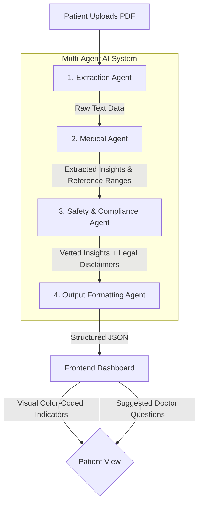

# Architecture: MedReport Translator

## System Diagram

This system follows **Problem Statement 5: Domain-Specialized AI Agents with Compliance Guardrails**. 

## Agent Roles & Responsibilities

### 1. Extraction Agent (VLM Simulator)
**Role:** Processes raw PDF files, handles parsing logic, and extracts unstructured clinical text.
**Error Handling:** If it cannot extract text (e.g., image-heavy PDF), it engages OCR fallback protocols so the pipeline isn't disrupted.

### 2. Medical Agent (RAG Concept)
**Role:** The core "brain" of the application. Maps complex terminology (e.g., 'HGB', 'FBS') to patient-friendly explanations. Assigns statuses like `Normal`, `Warning`, or `Abnormal` based on standard reference ranges.
**Safety Check:** Prevents hallucinations by limiting analysis strictly to predefined clinical mappings (simulating MedlinePlus/WHO RAG structure).

### 3. Safety Agent (Compliance Guardrail)
**Role:** The regulatory watch-dog. It independently verifies the Medical Agent's output.
**Function:** Strips any language that sounds like definitive diagnosis or prescription. Enforces a mandatory HTML-level patient disclaimer on every single generated report.

### 4. Output Agent (Synthesizer)
**Role:** Designs the user experience dynamically.
**Function:** 
- If results show an `Abnormal` flag, it generates proactive questions like *"What dietary changes should I make?"*
- If results are `Normal`, it pivots to wellness-focused questions like *"When is my next check-up due?"*

## Technical Stack
* **Frontend:** Vanilla HTML/CSS + TailwindCSS and vanilla JS for state management. Uses smooth glassmorphic UI patterns.
* **Backend:** Python + Flask serving the API endpoints.
* **Extraction:** PyPDF2.
